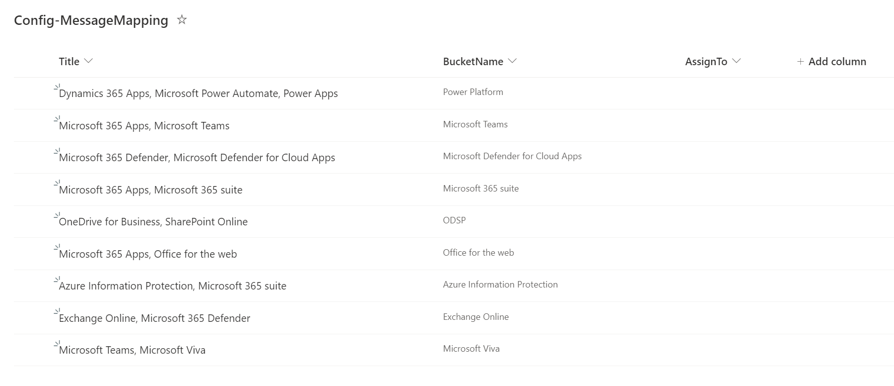

# Message Center Tracking
## Automate the organization of Message Center messages in Planner buckets and use labels to quickly identify which message require immediate attention
To get the Message Center messages into Planner so you can start managing/assigning them, start by following this guide: [Track message center tasks in Planner - Microsoft 365 - Microsoft Planner | Microsoft Learn](https://learn.microsoft.com/en-us/office365/planner/track-message-center-tasks-planner)


### Set up Planner buckets and labels

1. This flow assumes we have a bucket for every product (which I get from the task title)

	- For example: task with title *[SharePoint Online] OneDrive admin blah blah blah* goes in the `SharePoint Online` bucket

    - This flow also now supports mapping the product/service from the message title to any bucket you want. This is done with a simple SharePoint list in the next section.

2. Create one bucket in your Planner plan for each of the following (assuming you checked all services when setting up the flow), if you want buckets that correspond to services. If you want your own buckets (like Collaboration, Security, Messaging, etc.), create those and populate the mapping table in the next section.
    ```
    Exchange Online
    SharePoint Online
	Yammer
    Microsoft 365 suite
	Office for the web
	General announcement
	Planner
	OneDrive for Business
	Microsoft Teams
	Microsoft Forms
	Identity Service
	Microsoft 365 Apps
	Dynamics 365
	Power Apps
	Microsoft Defender for Endpoint
	Microsoft Power Automate
	Microsoft Power Automate for Microsoft 365
	Skype for Business
    Windows
    Microsoft Viva
    Azire Information Protection
    Microsoft 365 Defender
    Microsoft Bookings
    Stream
    Universal Print
    Power BI
    ```

3. Note: if we don't have a bucket for the associated product name (they've used a few I didn't have in the past couple months), the task will just stay in the default bucket.

4. Edit the following label names:

    | Label color | Label name |
    | --- | --- |
    | Red | Prevent or Fix Issues |
    | Yellow | Plan for Change |
    | Green	| Stay Informed |

5. Note: You can use different label colors than these, just remember which one is which to update below in step 4 

    - TODO: `Tags` in the message look helpful, maybe we should map these to labels as well to be able to quickly identify User impact, for example
    
### Create and populate the SharePoint list to map messages to buckets

1. Create a list on the SharePoint site associated with your Planner plan named `Config-MessageMapping` and add one *Text* column (in addition to the `Title` column): `BucketName`


2. Add rows to the list to map incoming message titles (text inside the [] brackets) to buckets.
    - If there isn't an entry in this list for a message title, the flow will just try to put it in a bucket with that name without mapping.
    - The `BucketName` you enter must be the exact same as a bucket you have created in Planner



### Import and update the flows

1. After you’ve got the [Track message center tasks in Planner](https://learn.microsoft.com/en-us/office365/planner/track-message-center-tasks-planner) flow working, [follow these instructions to import](https://flow.microsoft.com/en-us/blog/import-export-bap-packages/) the [Put Message Center Posts In Associated Bucket](PutMessageCenterpostsinassociatedbucket.zip) flow working into your environment. 
 
2. After you [import the flow into Power Automate](https://flow.microsoft.com/en-us/blog/import-export-bap-packages/), you’ll need to make some changes:
 
3. In the trigger (first action) select your Group and Plan


4. Make the same change to the `List buckets` action


5. Expand the `Apply to each` and `If yes` actions to get to the `Update a task (v2)` action
	 
6. The `Update a task (v2)` action sets the new bucket for this task and marks one of the color labels True according to the Category. If you used different colors, cut/paste the function blocks accordingly.


 
7. If you wanted to assign the task to someone, you could add an action below to `Add assignees to a task` (I did NOT do this yet).


	 
8. Save and enable the flow. It will trigger whenever a task in your plan is created.

9. The [Move Message Center Task](MoveMessageCenterTasks.zip) flow enables you to put messages into their correct buckets in the case where we didn’t have the bucket created before and it was dropped in the default bucket. Just add the missing buckets, add a mapping to the SharePoint list, if needed, and manually run this flow.
    - You will need to make similar changes to the [Move Message Center Task](MoveMessageCenterTasks.zip) flow after importing it to connect to your Group and Plan and to find the ID for the default bucket in your plan. 
